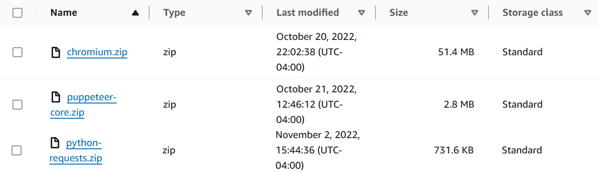
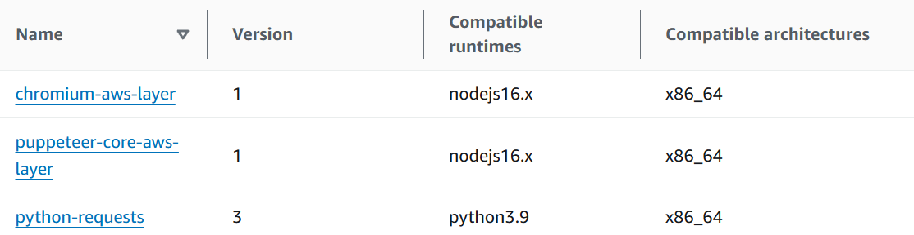

## Installation on AWS

1. Create an S3 bucket.
2. Create a folder "lib" in the bucket.
3. Upload code libraries files into "lib" on the S3 bucket:
   - [nodejs/layers/chromium.zip](nodejs/layers/chromium.zip) (source: https://github.com/Sparticuz/chromium/actions (version 107))
   - [nodejs/layers/puppeteer-core.zip](nodejs/layers/puppeteer-core.zip) (source: installed puppeteer-core locally, npm install --save puppeteer-core@18.1.0)
   - [py-code/layers/python-requests.zip](py-code/layers/python-requests.zip) (source: installed requests locally)
<p align="center">

</p>  
  
4. Create a Role LambdaWriteAccessRole.  
5. Attach managed policies to LambdaWriteAccessRole: 
   - AWSLambdaBasicExecutionRole
   - AWSXRayDaemonWriteAccess  
6. Create 3 Lambda function layers based on the files:
   - chromium-aws-layer from chromium.zip
   - puppeteer-core-aws-layer from puppeteer-core.zip
   - python-requests from python-requests.zip  
<p align="center">
  
</p>  

7. Create 3 Python Lambda functions:  
   - citizenship-status-bot (code in py-code/citizenship-status-bot). Timeout 30 sec, memory 128 MB.  
   - citizenship-status-bot-send (code in py-code/citizenship-status-bot-send).  Timeout 30 sec, memory 128 MB.  
   - citizenship-status-subscribed (code in py-code/citizenship-status-subscribed).  Timeout 10 sec, memory 512 MB.  
8. Assign LambdaWriteAccessRole in Permissions for all functions in task 7.  
9. Set Environment variable "BUCKET_NAME" equal to the name of the S3 bucket for all functions in task 7.   
10. Attach the python-requests Lambda layer to all functions in task 7.
11. Create 1 nodejs Lambda function:
    - citizenship-status-get (code in nodejs/citizenship-status-get)   
12. Assign LambdaWriteAccessRole in Permissions for citizenship-status-get.  
13. Set Environment variable "bucket_name" equal to the name of the S3 bucket for citizenship-status-get.  
14. Attach chromium and puppeteer-core layers to citizenship-status-get.  
15. Attach a custom policy to the LambdaAccessS3 role:
    - Lambda functions to have access to the S3 bucket
    - Lambda functions to be able to invoke each other  
```
	{
			"Sid": "S3AccessStatement",
			"Action": [
				"s3:GetObject"
			],
			"Effect": "Allow",
			"Resource": [
				"[arn for]:name-of-bucket/*"
			]
		}
{
			"Action": [
				"s3:ListBucket*"
			],
			"Effect": "Allow",
			"Resource": [
				"[arn for]:name-of-bucket"
			]
		},
		{
			"Sid": "AllObjectActions",
			"Effect": "Allow",
			"Action": "s3:*Object",
			"Resource": [
				"[arn for]:name-of-bucket/*"
			]
		},
 {
			"Effect": "Allow",
			"Action": "lambda:InvokeFunction",
			"Resource": [
				"[arm for]:citizenship-status-get",
				"[arn for]:citizenship-status-bot-send",
				"[arn for]:test-nodejs",
				"[arn for]:citizenship-status-email"
			]
		}
```
16. Set up EventBridge as a trigger for the function citizenship-status-subscribed. Schedule expression for twice daily run:   
```  
cron(0 12,21 * * ? *)  
```  
17. Set up a new API Gateway endpoint as a trigger for the function citizenship-status-bot.  
18. Set up a new telegram bot.
19. Define the AWS API endpoint from task 17 in the bot.
19. Put the bot's token as an environment variable "TELEGRAM_TOKEN" for citizenship-status-bot and citizenship-status-bot-send.
