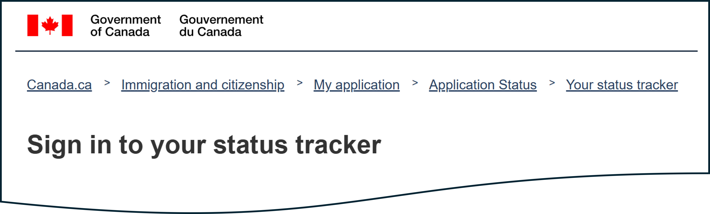

# check-citizenship
Automated checking for updates in Canadian citizenship application tracking (https://tracker-suivi.apps.cic.gc.ca/en/login).

## Overview  

  

  
People who submit their application to get a Canadian citizenship have an option to see the status of their application using an official tracker.  
In theory, using this tracker is not necessary: major changes like an invitation to take a test or a scheduled ceremony date should be communicated by email.  
But a lot of applicants prefer to check the tracker frequently:  
- there is a fear that the email systems, either on IRCC's or the applicant's side, can malfunction
- there are rumours that the tracker may show the change before an email confirms it, which might give an applicant more time to study for the test or to contact IRCC to change the date of the ceremony if needed

This automated solution can log on the IRCC tracker, grab a screenshot, and send it to the user.  
It can satisfy the itch to check and bring some peace of mind to the applicant.   

## User interface
A user interacts with the app using a bot in Telegram.  

A user can register in the app by providing credentials for the tracker:  
  

Then a user can either perform a one time check of the results:  

Or subscribe to receive updates automatically twice a day:  

  

## Architecture diagram

## Installation guide
See [INSTALL.md](INSTALL.md).
