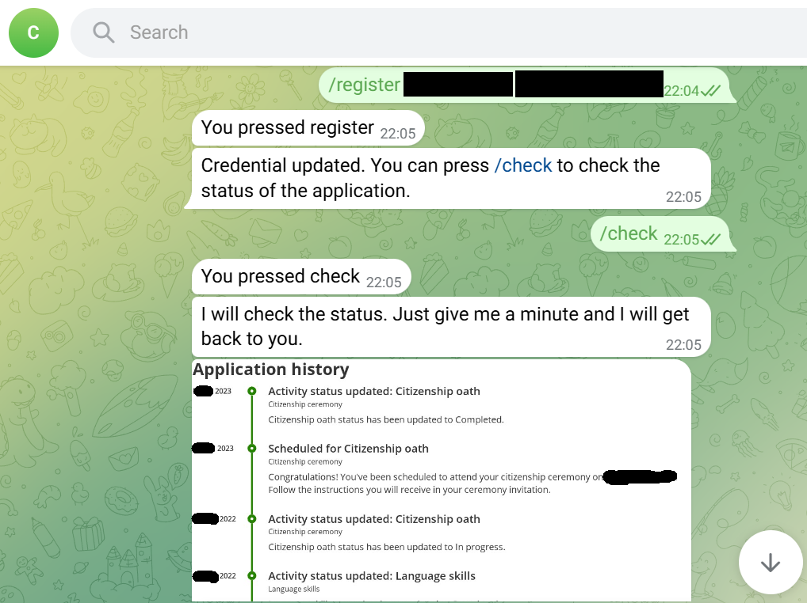
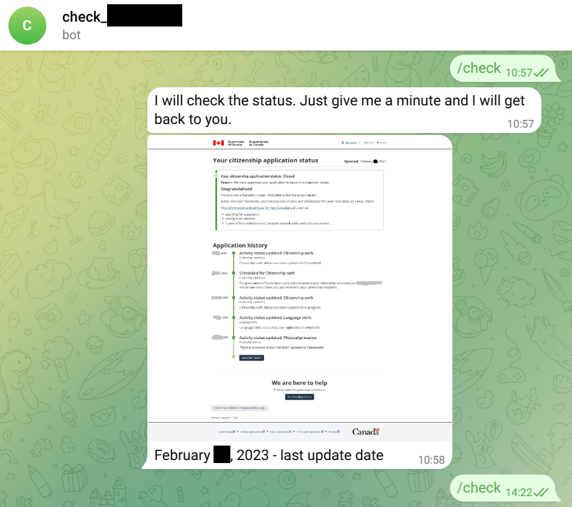
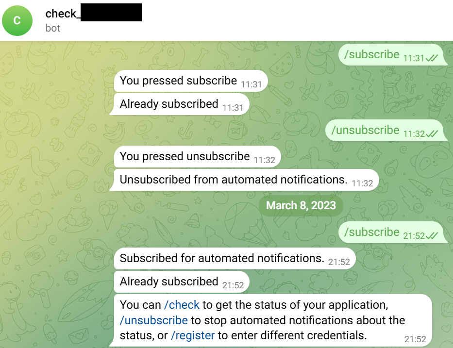
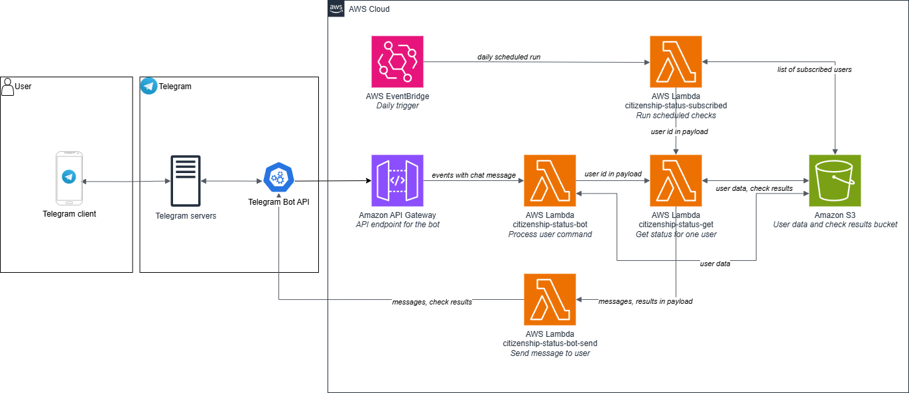

# check-citizenship
Automated checking for updates in Canadian citizenship application tracking (https://tracker-suivi.apps.cic.gc.ca/en/login).

## Overview

## User interface
A user interacts with the app using a bot in Telegram.  

A user can register in the app by providing credentials for the tracker:  
  

Then a user can either perform a one time check of the results:  

Or subscribe to receive updates automatically twice a day:  

  

## Architecture diagram

## Installation guide
See [INSTALL.md](INSTALL.md).
